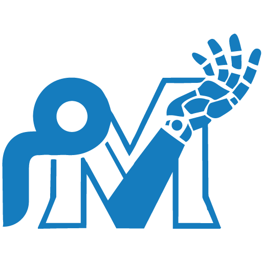

# سوق المساعدين — Mosaiden Souq MCP

اسأل ذكاءك الاصطناعي المفضّل بالعربية، وهو يبحث في **سوق المساعدين** ([mosaiden.com](https://mosaiden.com)):
متاجر (منها جرير وإكسترا بكل الماركات)، إعلانات مبوّبة، قوائم المطاعم بالأسعار، فنادق ورحلات — ويقارن الأسعار ويعطيك رابط الطلب.
وبعد ربط حسابك: ينشر إعلانك، وينشئ متجرك ويصمّمه، ويستورد منتجات علي إكسبريس (دروب شيبينج) ويعدّل الأسعار والصور والمقاسات.

Ask your favourite AI in Arabic or English to search the Saudi marketplace **Mosaiden Souq** — stores (Jarir, eXtra and more),
classified ads, restaurant menus, hotels and flights — and, once your account is connected, to publish your ad, build your store,
import AliExpress products for dropshipping and edit prices, photos, sizes and colours.

| | |
|---|---|
| Public endpoint (no sign-in) | `https://mosaiden.com/mcp` |
| Account endpoint (OAuth 2.1, dynamic client registration) | `https://mosaiden.com/mcp/me` |
| Official MCP Registry | `com.mosaiden/souq` |
| Docs | https://mosaiden.com/ai-connect |
| Privacy & support | https://mosaiden.com/ai-connect/privacy |

## Install

**Claude.ai · ChatGPT · Grok · Gemini app** — add a custom connector / app with `https://mosaiden.com/mcp/me`
(connect your account) or `https://mosaiden.com/mcp` (search only).
- Claude: Settings → Connectors → Add custom connector.
- ChatGPT: Settings → Plugins → Developer mode → new MCP plugin. After new tools ship: Manage → **Refresh tools**.
- Grok: grok.com/connectors → New Connector → Custom.
- Gemini: gemini.google.com → Settings → Connected Apps → Custom apps → Add a custom app (Google currently limits custom apps to
  personal accounts in supported countries).

**Gemini CLI**
```bash
gemini extensions install https://github.com/alkhadraa02/mosaiden-souq-mcp
```

**Antigravity CLI** — add to `mcp_config.json`:
```json
{ "mcpServers": { "souq": { "httpUrl": "https://mosaiden.com/mcp/me" } } }
```

**Qwen Code** (`qwen-extension.json`)
```bash
qwen extensions install alkhadraa02/mosaiden-souq-mcp
# or: qwen mcp add --transport http mosaiden-souq https://mosaiden.com/mcp/me
```

**QwenWork (desktop)** — Extensions → Connectors → + Add → manual, Streamable HTTP, `https://mosaiden.com/mcp`.

**Kimi Code**
```bash
kimi mcp add --transport http --auth oauth mosaiden-souq https://mosaiden.com/mcp/me
kimi mcp auth mosaiden-souq
# or inside Kimi Code: /plugins install https://github.com/alkhadraa02/mosaiden-souq-mcp
```

**DeepSeek Harness** — enable the official MCP plugin (`@deepseek-ai/dsh-mcp-client`) and add a streamable-http server
`https://mosaiden.com/mcp`.

**Meta Muse** — ask Muse in chat: «add a custom connector named سوق المساعدين with this URL» and paste `https://mosaiden.com/mcp`.

**Claude Code**
```bash
claude plugin marketplace add alkhadraa02/mosaiden-souq-mcp
claude plugin install mosaiden-souq@mosaiden-souq
```

**Codex**
```bash
codex plugin marketplace add alkhadraa02/mosaiden-souq-mcp
```

**Cursor / VS Code** — one-click links at https://mosaiden.com/ai-connect

## Plugin contents

| File | Used by |
|---|---|
| `plugin.json` + `mcp.json` (Agent Plugins, logo under `extensions.com.openai`) | ChatGPT, Codex |
| `.claude-plugin/plugin.json` + `.mcp.json` | Claude (Cowork, Claude Code, Claude directory) |
| `skills/mosaiden-souq/SKILL.md` | Usage guidance (which tool when, confirmation rules) |
| `assets/logo.png`, `assets/icon.png` | Plugin logo (512×512) |
| `gemini-extension.json` + `GEMINI.md`, `qwen-extension.json`, `kimi.plugin.json` | Gemini CLI, Qwen Code, Kimi Code |

## Tools

| Tool | What it does | Sign-in |
|---|---|---|
| `search_souq` | Search products, classified ads, stores, restaurants and meals | — |
| `compare_prices` | Phones & electronics across Jarir, eXtra and other stores, cheapest first | — |
| `search_restaurants` / `get_restaurant_menu` | Restaurants and official menus with SAR prices | — |
| `search_hotels` | Hotels in Saudi Arabia, UAE, Egypt, Bahrain, Kuwait, Oman, Jordan | — |
| `search_flights` | Cheapest flights; the airline's own booking link first | — |
| `web_search` | Saudi-focused web search | — |
| `find_image` | A suitable (illustrative) photo from our search engine when the user has no public photo URL | — |
| `list_assistants` / `search_assistants` / `list_categories` | Assistants, live-checked MCP servers, ad categories | — |
| `checkout_link` | Chosen store products ⇒ one cart link; the user pays on mosaiden.com | — |
| `my_account` | Plan, listings, stores and recent orders | `souq.read` |
| `search_aliexpress` | AliExpress products with landed cost, our price and a dashboard picker link | `souq.read` |
| `publish_listing` | Publish an ad — preview first; with no public photo it returns a pre-filled listing page for the user to add the photo | `souq.publish` |
| `create_store` / `update_store_design` | Create, rename or re-style the user's store | `souq.publish` |
| `import_aliexpress_product` | Dropshipping: import 1–6 products at our pricing with supplier sizes/colours | `souq.publish` |
| `add_store_product` / `update_store_product` | Add or edit products: price, name, photos, sizes, colours, stock | `souq.publish` |

Every write shows a preview and runs only after the user approves. Results render as interactive cards in hosts that support MCP
Apps. Ordering, booking and payment always happen on mosaiden.com — the connector never asks for card details.

## License

MIT — this repository only contains install manifests; the service itself runs at mosaiden.com.
